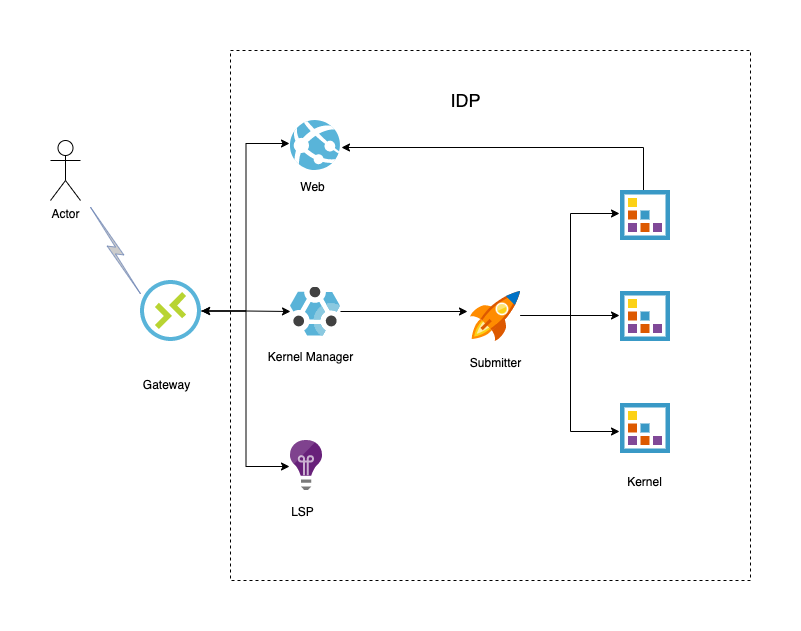

<div align="right">

  [English](README.md) | [简体中文](README_zh.md)

</div>


[](https://github.com/BaihaiAI/IDP/blob/main/LICENSE)
[](https://www.rust-lang.org/)
[](https://www.javascript.com/)
[](https://www.python.org/)


## 什么是IDP？
IDP是一款自研AI IDE（人工智能集成开发环境），专为AI和数据科学开发人员（如数据科学家、算法工程师）打造，帮助数据科学家和算法工程师提升AI开发效率。

IDP原生支持Python和SQL——这是在AI和数据科学领域中使用最广泛的两种语言。针对数据科学家和算法工程师的使用习惯和AI开发的特点，还应具备“效率插件”，如版本管理、环境管理与克隆、变量管理、预置代码片段、智能代码辅助等，减少数据科学家和算法工程师用于开发准备和辅助工作的时间。

IDP内核使用Rust语言编写，具有出色的运行性能。

IDP采取插件式架构，可便捷集成AI开发全流程所需的插件，如数据标注插件、超参数优化插件等。后续我们也将构建插件库，欢迎感兴趣的开发者们共同参与插件的打造。

## 核心功能
目前IDP已内置丰富的效率插件，帮助数据科学家和算法工程师更专注于核心工作——算法开发。

IDP的核心功能如下：
● 支持多语言： 交互式编程环境，在同一个notebook中能够同时支持Python、SQL和Markdown语言。

● 数据可视化： 可以直接使用内置的数据可视化工具生成数据分析结果图，如柱状图、散点图、线状图等。

● 自动版本管理： 天然内置版本管理功能，用户可便捷跟踪和管理代码更改，清晰地进行版本对比。

● 代码辅助功能： 拥有强大的代码辅助功能，包括智能代码补全、快捷修复、定义跳转等。

● 包管理器： 轻松有效地搜索和管理Python软件包。

● 变量管理器： 可以交互式浏览和管理变量，方便比较不同的算法方法和参数设置。

● 环境管理： 支持多个运行环境，支持切换环境，支持安装、卸载、管理Python包；支持自定义运行环境，支持环境持久化存储，支持克隆环境。

● 大纲：支持查看Markdown标题大纲，以及快速定位至标题所在位置。

● 全局搜索：支持全局搜索，可以搜索文件和文本文件中的字符，并进行文件定位。

● 文件管理器：具备目录是结构文件管理器，支持文件页签管理，支持预览图片、Excel文件。

● 终端：可通过终端运行一些高级脚本、进行安装操作或其他任务。



## 快速上手指南

### 在Docker内启动IDP
``` bash
> docker pull baihaiopensource/idp-studio
> docker run -p 3000:3000 baihaiopensource/idp-studio
```
然后用在浏览器打开 http://localhost:3000。

### 使用预编译的二进制包启动IDP

- [Windows x86_64](https://baihai.cn-bj.ufileos.com/package/idp-studio-v1.0.0-win-x64.zip)
- [macOS arm64](https://baihai.cn-bj.ufileos.com/package/idp-studio-v1.0.0-darwin-arm64.tar.gz)
- [macOS x86_64](https://baihai.cn-bj.ufileos.com/package/idp-studio-v1.0.0-darwin-x64.tar.gz)
- [Linux x86_64](https://baihai.cn-bj.ufileos.com/package/idp-studio-v1.0.0-linux-x64.tar.gz)

注意：在Linux下用预编译的二进制包启动IDP，需要Python 3.7及以上版本（CPython和PyPy）。

```
wget http://baihai.cn-bj.ufileos.com/package/idp-studio-v1.0.0-linux-x64.tar.gz
tar zxf idp-studio-v1.0.0-linux-x64.tar.gz
cd idp-studio-v1.0.0-linux-x64
./idp
```

### 在Cloud上启动IDP:
快速了解IDP SaaS，请点击 <https://www.baihai.co/invitation.html>

### 通过编译源码部署IDP
请参阅[从源代码编译和部署IDP](/docs/compile-deploy-from-source.md)


## 贡献方式
请阅读[contribution.md](/docs/contributing.md)，了解向IDP提交issues和pull requests的详细过程。

## 社区行为守则
请阅读[社区行为守则](/docs/code-of-conduct.md)，该文档描述了在IDP开源社区需要遵守的行为准则。

## IDP用户手册
对于具体功能和使用说明，请查看[IDP用户手册](https://baihai-idp.yuque.com/mwvla8/tyonh6?#)


## 怎样联系我们
如果你有任何关于IDP的问题，欢迎通过以下方式与我们取得联系：
 - [Slack](https://join.slack.com/t/idp-tjo1834/shared_invite/zt-1kee8cd8x-iNZ0rvwClRfx7sLgmmKKyg)
 - [领英Linkedin](https://www.linkedin.com/company/80179567/admin/)
 - [Bilibili](https://space.bilibili.com/1227589642)
 - [发送邮件](https://baihai.co/contactus.html)
 - [加入微信交流群](https://raw.githubusercontent.com/BaihaiAI/IDP/main/docs/WeChat%20Group%20QR.png)


## IDP使用的开源许可证
本项目使用 [Apache-2.0 License](LICENSE).
